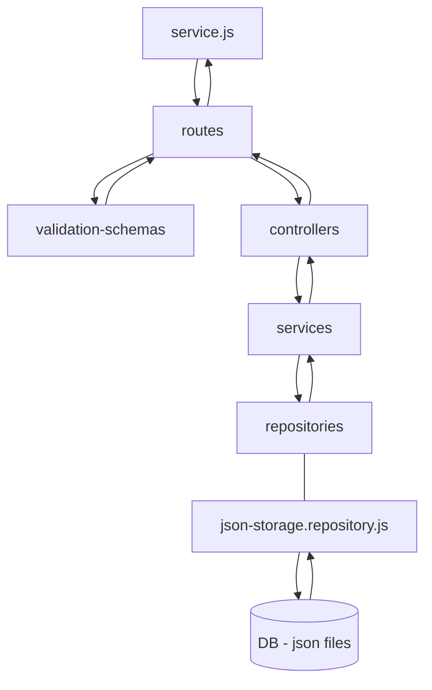

# gses-test-task

GSES2 BTC application

# App installation

1. Create `.env` file and copy `.env.example` in it. `.env.example` has valid data for convenient testing.
2. Run `npm install`
3. Run `npm run start`

# Docker

Steps to run app in docker:

1. Pull image:  
   `docker pull dolphin323/gses-test-task:gses-test-task`
2. Create image if you **haven't already pulled one**:  
   `docker build -t dolphin323/gses-test-task:gses-test-task . `
3. Run container:  
   `docker run -dp 3000:3000 -v gses-test-task:/server/data --rm --name container-gses-test-task dolphin323/gses-test-task:gses-test-task`
4. Stop container when you want to stop app running in docker:  
   `docker stop container-gses-test-task`

# App structure

## Description of entities

- server.js - mail file where app starts listening to requests
- routes - folder where all routes defined with heir fields (url, method, hadler and etc.)
- validation-schemas - folder where all validation schemas are defined, which are used as middlewares to validate request
- controllers - folder where all handlers for requests are defined
- services - folder where all services for working with separate entities are defined (email, currency)
- repositories - folder where repositories are defined, they are used for working with separate operations. F.e http requests, json storage operations (like working with DB).

Also in app structure there is utils folder where helpers, contants and enums are defined.
